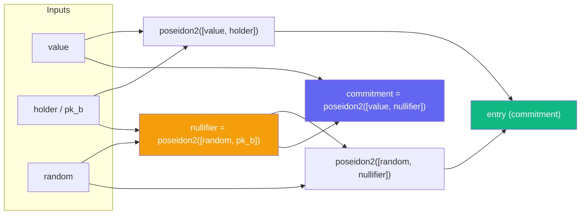
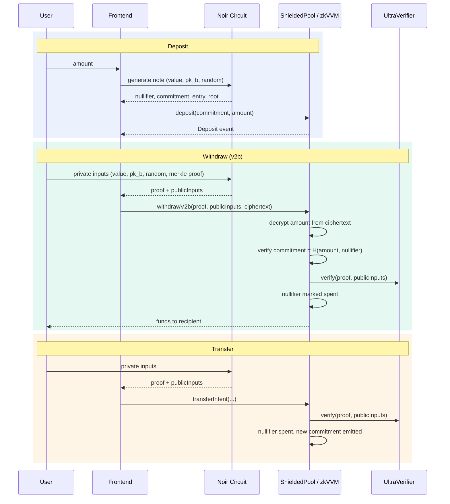

# zkVVM

**Privacy for users, transparency for institutions.**

A privacy-preserving **Shielded Pool** protocol built with [Noir](https://noir-lang.org/) zero-knowledge circuits, [Solidity](https://soliditylang.org/) smart contracts, and a [React](https://react.dev/) + [Vite](https://vite.dev/) frontend. Each institution deploys its own zkVVM instance via [EVVM](https://github.com/EVVM-org) — inter-institutional flows are transparent and auditable, while individual user transactions remain private through ZK proofs.

> See [PITCH.md](PITCH.md) for the full vision and narrative.

## Architecture

```text
zkVVM/
├── packages/
│   ├── contracts/                # Solidity smart contracts
│   │   ├── ShieldedPool.sol      # Standalone privacy pool (deposit, transfer, withdraw, withdrawV2b)
│   │   ├── zkVVM.sol             # EVVM-integrated pool (gasless meta-tx deposits & withdrawals)
│   │   ├── IVerifier.sol         # Proof verification interface
│   │   ├── UltraVerifier.sol     # Auto-generated UltraPlonk verifier
│   │   ├── MockERC20.sol         # Test token
│   │   └── MockVerifier.sol      # Test verifier stub
│   │
│   ├── noir/                     # Noir ZK circuits
│   │   ├── src/
│   │   │   ├── main.nr           # Withdraw v2b circuit (value-private withdrawal)
│   │   │   ├── withdraw.nr       # Withdraw v2b circuit (recipient-bound)
│   │   │   ├── note_generator.nr # Note generation (nullifier, commitment, entry, root)
│   │   │   ├── commitment_helper.nr # Compute commitment = H(value, nullifier)
│   │   │   ├── nullifier_helper.nr
│   │   │   └── root_helper.nr
│   │   ├── scripts/              # Deposit, compute, nullifier, and compile scripts
│   │   └── libs/                 # Poseidon, Edwards, Merkle tree libraries
│   │
│   └── vite/                     # React frontend
│       ├── components/           # Deposit UI
│       ├── hooks/                # Proof generation & verification hooks
│       ├── lib/
│       │   ├── note.ts           # Note generation via Noir circuit (noir_js)
│       │   ├── usdc.ts           # USDC amount parsing (6 decimals)
│       │   └── services/
│       │       └── zkVVM.ts      # EVVM service (signed deposit & withdraw actions)
│       └── types/
│           └── zkVVM.types.ts    # TypeScript interfaces for EVVM actions
│
├── tests/                        # Integration & proving system tests
├── scripts/                      # Utility scripts (ciphertext generation)
├── hardhat.config.cts            # Contract deployment & network config
└── package.json                  # Monorepo workspace root
```

## Stack

| Layer | Technology |
| ----- | ---------- |
| ZK Circuits | Noir, ACVM |
| Proving Systems | UltraPlonk, UltraHonk (@aztec/bb.js) |
| Cryptography | Poseidon2, Keccak256, Binary Merkle Trees |
| Smart Contracts | Solidity 0.8.x, Hardhat |
| Meta-Transactions | EVVM (@evvm/evvm-js, @evvm/testnet-contracts) |
| Frontend | React, TypeScript, Vite |
| Blockchain | Wagmi, Viem |
| Runtime | Bun |

## How It Works

### Note Structure

Every deposit creates a **note** — a Poseidon2 hash commitment:



The `note_generator.nr` circuit computes `(nullifier, commitment, entry, root)` from `(value, pk_b, random)` and is used by the frontend via `noir_js.execute()` to generate notes client-side.

### Circuits

| Circuit | Purpose | Public Inputs |
| ------- | ------- | ------------- |
| `main.nr` / `withdraw.nr` | Withdraw v2b — prove note ownership, bind to recipient | nullifier, merkle_proof_length, expected_root, recipient, commitment |
| `note_generator.nr` | Generate note data (nullifier, commitment, entry, root) | (executed client-side via noir_js) |
| `commitment_helper.nr` | Compute `commitment = H(value, nullifier)` | commitment (public output) |
| `nullifier_helper.nr` | Compute nullifier + root from a note | (helper) |
| `root_helper.nr` | Compute merkle root from a commitment path | (helper) |

### Protocol Flow



### Contracts

#### ShieldedPool (standalone)

- **`deposit(commitment, amount)`** — Store a commitment, emit Deposit event
- **`transferIntent(root, nullifier, ..., proof)`** — Private note transfer, verified on-chain
- **`withdraw(proof, publicInputs)`** — Withdraw with value as public input
- **`withdrawV2b(proof, publicInputs, ciphertext)`** — Withdraw with encrypted amount (value stays private, decrypted on-chain via `keccak256(nullifier || recipient || POOL_SALT)`)
- **`registerRoot(root)`** — Register a valid merkle root (computed off-chain)

#### zkVVM (EVVM-integrated)

Extends `EvvmService` for gasless meta-transaction execution. Users sign actions off-chain; an executor submits them on-chain.

- **`deposit(user, commitment, amount, ..., signature, signaturePay)`** — Meta-tx deposit with EVVM payment
- **`withdraw(user, proof, publicInputs, ..., signature)`** — Meta-tx withdrawal with proof verification
- **`registerRoot(root)`** — Register a merkle root

Double-spend protection via nullifiers. Reentrancy-guarded. Recipient binding prevents front-running.

### Frontend EVVM Service

The `zkVVM` service class (`packages/vite/lib/services/zkVVM.ts`) wraps deposit and withdraw into signed EVVM actions using `@evvm/evvm-js`. It handles message building, signing, and produces `SignedAction` objects ready for executor submission.

## Getting Started

### Prerequisites

- [Bun](https://bun.sh/docs/installation)
- [Nargo](https://noir-lang.org/docs/getting_started/installation/) (Noir toolchain)

### Install

```bash
bun i
```

### Run Locally

```bash
# 1. Start a local Ethereum node
bunx hardhat node

# 2. Compile circuit & deploy verifier contract
bun run deploy

# 3. Start the frontend dev server
bun dev
```

### Testing

```bash
# Run all tests (UltraPlonk + UltraHonk + ShieldedPool)
bun run test

# UltraPlonk only
bun run test:up

# UltraHonk only
bun run test:uh
```

Tests cover: deposit/withdraw flows with real ZK proofs, duplicate commitment rejection, nullifier double-spend prevention, unknown root rejection, and ciphertext-based withdrawals (v2b).

## Noir Scripts

```bash
# Compute Poseidon2 hashes and merkle roots (demo)
cd packages/noir && bun scripts/compute.mjs

# On-chain deposit via CLI
MONAD_RPC=<rpc_url> PRIVATE_KEY=<key> POOL_ADDRESS=<addr> bun scripts/deposit.mjs

# Compile withdraw.nr into a Solidity verifier
./packages/noir/scripts/compile_withdraw_verifier.sh

# Compute a commitment hash
./packages/noir/scripts/compute_commitment.sh

# Compute a nullifier
./packages/noir/scripts/compute_nullifier.sh

# Generate ciphertext for v2b withdraw
bun run gen-ciphertext
```

See [PROVER_WORKFLOW.md](packages/noir/PROVER_WORKFLOW.md) for the full variable-amount proving workflow.

## Deploying to Testnets

Supported networks: **Holesky**, **Scroll Sepolia** (add more in `hardhat.config.cts`).

```bash
# Set your private key for a network
bunx hardhat vars set holesky <your_private_key>

# Deploy to that network
bunx hardhat deploy --network holesky
```

Networks must be [supported by Wagmi](https://wagmi.sh/react/api/chains#available-chains) and configured in `hardhat.config.cts`.

## Project Scripts

| Command | Description |
| ------- | ----------- |
| `bun i` | Install dependencies |
| `bun dev` | Start Vite dev server |
| `bun run deploy` | Compile circuit & deploy verifier contract |
| `bun run node` | Start local Hardhat node |
| `bun run test` | Run all tests |
| `bun run test:up` | Run UltraPlonk tests |
| `bun run test:uh` | Run UltraHonk tests |
| `bun run gen-ciphertext` | Generate v2b withdrawal ciphertext |

## License

MIT
