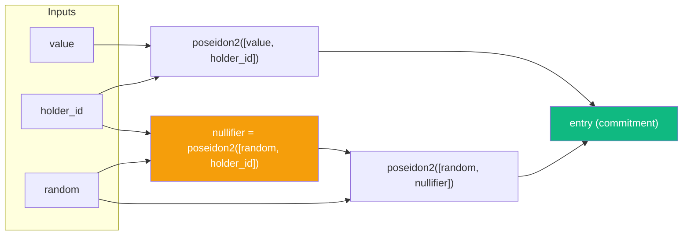
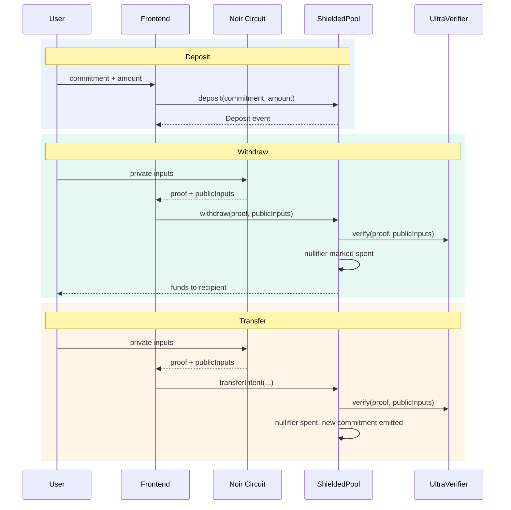

# zkVVM - Zero-Knowledge Virtual Machine

> ⚠️ **Status:** Development (feat/evvm-integration branch)
> - 🔴 **Not Production Ready** - See [Production Gaps](docs/PRODUCTION_GAPS.md)
> - ✅ **Functional on Sepolia EVVM** with MockVerifier

A **gasless, privacy-preserving protocol** built on [EVVM](https://evvm.network/) (Ethereum Virtual Virtual Machine) using [Noir](https://noir-lang.org/) zero-knowledge circuits. Users deposit tokens as bearer notes and withdraw to any address without revealing the link between depositor and recipient - **all without paying gas fees**.

## Key Features

- 🎭 **Full Privacy:** Zero-knowledge proofs hide transaction graphs
- ⛽ **Gasless UX:** Users sign messages; Fisher relayers execute transactions
- 🪙 **Bearer Notes:** Notes are digital cash (secret + salt = ownership)
- 🌐 **EVVM Integration:** Native integration with EVVM protocol for gasless execution
- 🔐 **Merkle Tree:** On-chain state commitment for scalability

## Quick Start

### Prerequisites

- [Bun](https://bun.sh/) v1.0+
- [Nargo](https://noir-lang.org/docs/getting_started/installation/) v0.39+ (Noir CLI)
- MetaMask or compatible Web3 wallet
- Sepolia EVVM testnet funds

### Installation

```bash
# Clone and install
git clone https://github.com/0xj4an/zkVVM.git
cd zkVVM
git checkout feat/evvm-integration
bun install

# Install Fisher dependencies
cd fisher && bun install && cd ..

# Configure environment
cp .env.example .env
# Edit .env with your keys
```

### Compile Circuits

```bash
cd packages/noir
nargo compile
cd ../..
```

### Compile Contracts

```bash
bunx hardhat compile --config hardhat.config.cts
```

### Run Development

```bash
# Terminal 1: Start Fisher relayer
bun run start:fisher

# Terminal 2: Start frontend
cd packages/vite && bun run dev

# Open http://localhost:5173
```

## Architecture

```text
zkVVM/
├── packages/
│   ├── contracts/                # Solidity smart contracts (EVVM Services)
│   │   ├── zkVVM.sol             # Main contract - inherits EvvmService
│   │   ├── IVerifier.sol         # Proof verification interface
│   │   ├── UltraVerifier.sol     # UltraPlonk verifier (production)
│   │   └── MockVerifier.sol      # Mock verifier (development only)
│   │
│   ├── noir/                     # Noir ZK circuits (beta.18)
│   │   ├── src/
│   │   │   ├── main.nr           # Withdraw circuit (main)
│   │   │   ├── withdraw.nr       # Withdrawal with Merkle proof
│   │   │   ├── note_generator.nr # Bearer token generation
│   │   │   ├── split.nr          # Split 1 note into 4 notes
│   │   │   └── simple.nr         # Testing circuit
│   │   └── target/
│   │       └── noirstarter.json  # Compiled withdraw circuit
│   │
│   └── vite/                     # React frontend (Vite + Wagmi)
│       ├── pages/
│       │   ├── DashboardPage.tsx # Deposit UI
│       │   ├── WithdrawPage.tsx  # Withdraw UI
│       │   └── LandingPage.tsx   # Marketing page
│       ├── lib/
│       │   ├── hooks/
│       │   │   ├── useEvvm.ts    # EVVM signer integration
│       │   │   └── useZK.ts      # ZK proof generation
│       │   └── services/
│       │       ├── zkVVM.ts      # SignedAction builder
│       │       └── ZKService.ts  # Noir circuit executor
│       └── components/           # UI components
│
├── fisher/                       # Fisher relayer (HTTP server)
│   └── index.ts                  # Executes SignedActions on-chain
│
├── scripts/                      # Deployment scripts
│   ├── deploy-zkvvm.js
│   ├── deploy-ultra-verifier.js
│   └── check-env.ts              # Environment validation
│
├── deployments/
│   └── sepolia_evvm/
│       └── addresses.json        # Deployed contract addresses
│
├── docs/                         # Documentation
│   ├── COMPARISON.md             # Main vs EVVM-Integration comparison
│   ├── PRODUCTION_GAPS.md        # Production readiness checklist
│   └── ZK_FLOW.md                # Bearer note cryptography
│
└── tests/                        # Integration tests
├── hardhat.config.cts            # Contract deployment & network config
└── package.json                  # Monorepo workspace root
```

## Stack

| Layer | Technology |
| ----- | ---------- |
| ZK Circuits | Noir, ACVM |
| Proving Systems | UltraPlonk, UltraHonk (@aztec/bb.js) |
| Cryptography | Poseidon2, Baby Jubjub (Edwards), Keccak256, Binary Merkle Trees |
| Smart Contracts | Solidity 0.8.28, Hardhat |
| Frontend | React, TypeScript, Vite |
| Blockchain | Wagmi, Viem |
| Runtime | Bun |

## How It Works

### Note Structure

Every deposit creates a **note** — a Poseidon2 hash commitment:



### Note String Format

Bearer notes are stored and shared as strings with the following format:

`zk-<amount>-<secret>-<salt>`

- **amount**: The value of the note in decimal (e.g., `100.00`).
- **secret**: The bearer secret key in hex format (e.g., `0x123...`). This is the private secret you must keep safe.
- **salt**: A cryptographic salt used for nullifier and commitment derivation in hex format.

Note: the Noir circuits and compiled artifacts still use parameter names `pk_b` and `random`. Frontend code uses `secret`/`salt` for clarity and maps them to `pk_b`/`random` when invoking the circuits.

This string contains all the secrets required to recompute the note's nullifier and generate a ZK proof for withdrawal.

### Circuits

| Circuit | Purpose | Public Inputs |
| ------- | ------- | ------------- |
| `main.nr` | Private note-to-note transfers | newCommitment, nullifier, merkleProofLength, expectedRoot |
| `withdraw.nr` | Withdraw to a specific recipient | value, nullifier, merkleProofLength, expectedRoot, recipient |
| `nullifier_helper.nr` | Compute nullifier + root from a note value | (helper) |
| `root_helper.nr` | Compute merkle root from a commitment path | (helper) |

### Protocol Flow



### ShieldedPool Contract

- **`deposit(commitment, amount)`** — Store a commitment, emit Deposit event
- **`transferIntent(root, nullifier, ..., proof)`** — Private note transfer, verified on-chain
- **`withdraw(proof, publicInputs)`** — Withdraw to recipient bound in the ZK proof
- **`registerRoot(root)`** — Register a valid merkle root (computed off-chain)

Double-spend protection via nullifiers. Reentrancy-guarded. Recipient binding prevents front-running.

## Getting Started

### Prerequisites

- [Bun](https://bun.sh/docs/installation)
- [Nargo](https://noir-lang.org/docs/getting_started/installation/) (Noir toolchain)

### Install

```bash
bun i
```

### From Scratch (EVVM Sepolia)

```bash
# 1) Install dependencies
bun install

# 2) Create env file
cp .env.example .env

# 3) Start fisher (optional but recommended)
bun run start:fisher

# 4) Deploy contracts to EVVM Sepolia (mock verifier)
bun run deploy:sepolia

# 5) Switch to real verifier when ready
bun run deploy:sepolia:real

# 6) Start frontend
bun run vite:dev
```

### Run Locally

```bash
# 1. Start a local Ethereum node
bunx hardhat node

# 2. Compile circuit & deploy verifier contract
bun run deploy

# 3. Start the frontend dev server
bun dev
```

### Testing

```bash
# Run all tests (UltraPlonk + UltraHonk + ShieldedPool)
bun run test

# UltraPlonk only
bun run test:up

# UltraHonk only
bun run test:uh
```

Tests cover: deposit/withdraw flows with real ZK proofs, duplicate commitment rejection, nullifier double-spend prevention, and unknown root rejection.

## Noir Scripts

```bash
# Compute Poseidon2 hashes and merkle roots (demo)
cd packages/noir && bun scripts/compute.mjs

# On-chain deposit via CLI
MONAD_RPC=<rpc_url> PRIVATE_KEY=<key> POOL_ADDRESS=<addr> bun scripts/deposit.mjs

# Compile withdraw.nr into a Solidity verifier
./packages/noir/scripts/compile_withdraw_verifier.sh
```

See [PROVER_WORKFLOW.md](packages/noir/PROVER_WORKFLOW.md) for the full variable-amount proving workflow.

## Deploying to Testnets

Supported networks: **Holesky**, **Scroll Sepolia** (add more in `hardhat.config.cts`).

```bash
# Set your private key for a network
bunx hardhat vars set holesky <your_private_key>

# Deploy to that network
bunx hardhat deploy --network holesky
```

Networks must be [supported by Wagmi](https://wagmi.sh/react/api/chains#available-chains) and configured in `hardhat.config.cts`.

## Deploying to EVVM Sepolia

This project deploys three contracts on EVVM Sepolia using Hardhat + viem:

- `MockVerifier` (test-only)
- `UltraVerifier` (real verifier)
- `zkVVM` (core pool contract wired to a verifier address)

`zkVVM` takes the verifier address in the constructor, so switching from MockVerifier to UltraVerifier is done by redeploying `zkVVM` with the new verifier address.

### Required Environment Variables

Set these before deploying:

- `EVVM_SEPOLIA_RPC_URL`
- `EVVM_SEPOLIA_KEY`
- `EVVM_CORE_ADDRESS`
- `EVVM_STAKING_ADDRESS`
- `ZKVVM_ADMIN_ADDRESS`
- Optional: `EVVM_SEPOLIA_CHAIN_ID` (defaults to 11155111)
- Optional: `WITHDRAW_VERIFIER_ADDRESS` (override verifier address for zkVVM deployment)

### Step 1: Deploy MockVerifier + zkVVM (mock wiring)

```bash
bun run deploy:sepolia
```

This will:
- Deploy `MockVerifier`
- Deploy `zkVVM` wired to the MockVerifier address
- Store addresses in `deployments/sepolia_evvm/addresses.json`

### Step 2: Deploy UltraVerifier + redeploy zkVVM (real wiring)

```bash
bun run deploy:sepolia:real
```

This will:
- Deploy `UltraVerifier`
- Redeploy `zkVVM` wired to the new verifier address
- Update `deployments/sepolia_evvm/addresses.json`

If you need to force a specific verifier address, set `WITHDRAW_VERIFIER_ADDRESS` before running the command.

### Address Output

All deployments write to:
- `deployments/sepolia_evvm/addresses.json`

Use this file to configure the frontend and scripts with the latest deployed addresses.

## Project Scripts

| Command | Description |
| ------- | ----------- |
| `bun i` | Install dependencies |
| `bun dev` | Start Vite dev server |
| `bun run deploy` | Compile circuit & deploy verifier contract |
| `bun run node` | Start local Hardhat node |
| `bun run test` | Run all tests |
| `bun run test:up` | Run UltraPlonk tests |
| `bun run test:uh` | Run UltraHonk tests |
| `bun run deploy:sepolia` | Deploy MockVerifier + zkVVM to EVVM Sepolia |
| `bun run deploy:sepolia:real` | Deploy UltraVerifier + redeploy zkVVM on EVVM Sepolia |

## License

MIT
